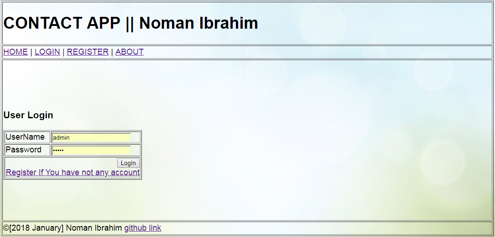
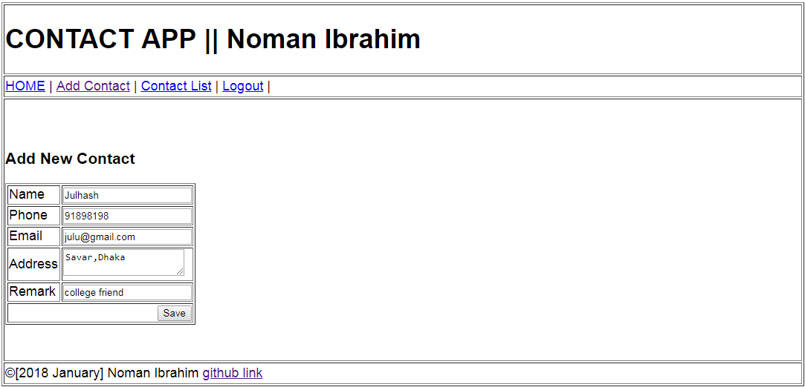
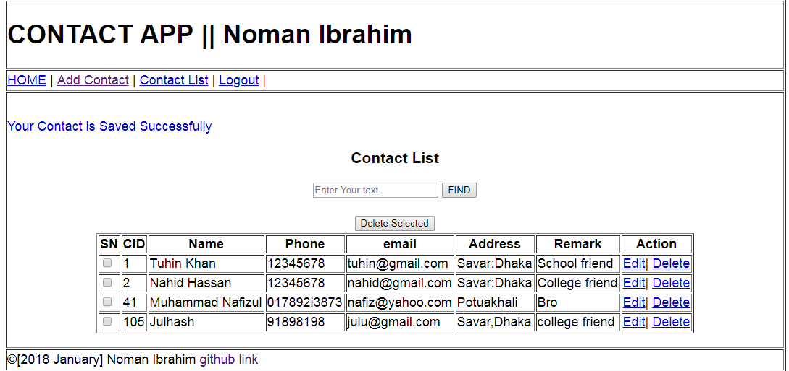
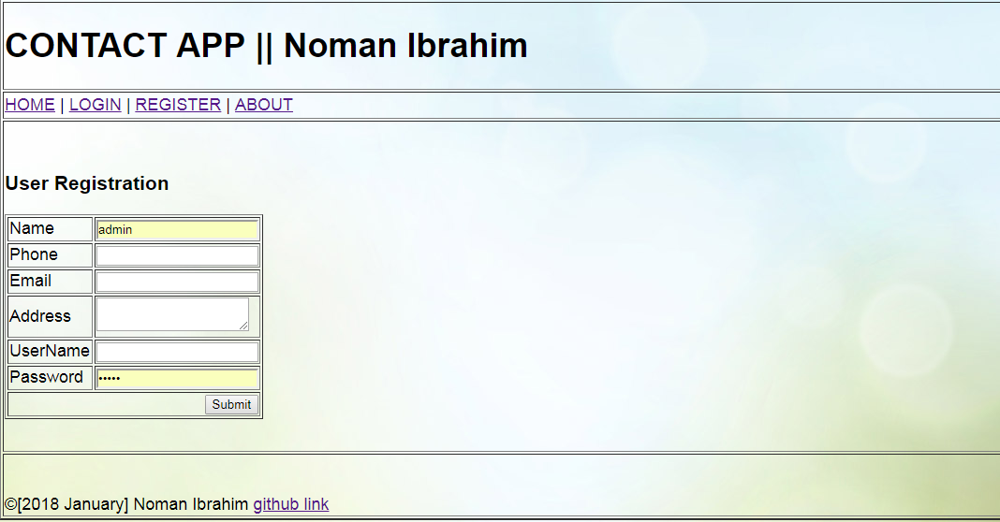

# Project Title
Contact Number Manager

## Description

A web app build on java and Spring Web MVC. Users can save contact number which is a replacement of old analog phonebbok
   * Multi user Application.
   * Roles: Use & Admin.
   * User Registration.
   * Login: User & Admin.
   * Logout: User & Admin.
   * Add contact.
   * Delete Contact.
   * Edit/ Update contact.
   * List Contact.
   * Search contact ( Free text).\
   * Admin can see all registered users.
   * Admin can block or active any user.

# Guidelines, that were taken care:
   * Modular Development.
        * Web Layer (MVC)
        * Business Layer( Service, DAO)
   * Code Reusibility.
   * Loose Coupling.
   * Extensibility.
   * Customaizablity.
 
# Technology I have used
  ### Front End
     * jsp. 
     * HTML, CSS, JavaScript.
     * JSTL.
  ### Back End
     * java
  ### Frame Work
     * Spring MVC
  ### Database
     * MySql
     * H2 database engine.
     * Spring Jdbc Template.
  ### IDE
     * Netbeans (8.2)
  ### Build Tool
     * Maven
     
  ### Version control
     * GitHub
  ### Server
     * Apache Tomcat (7)
     
  #Screen Shots
  
  
  
  
  
  
  
  
  
